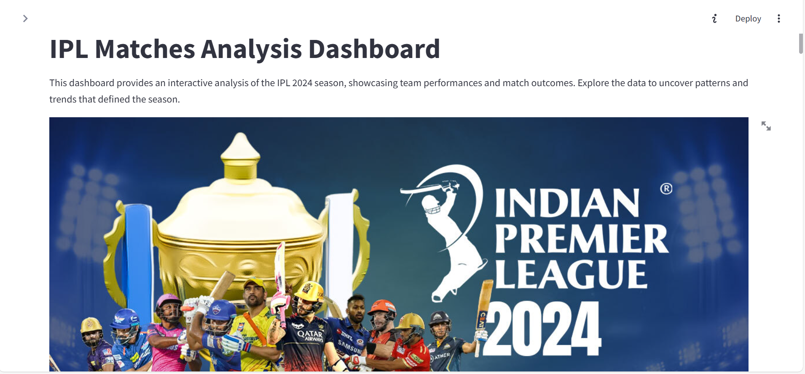

# IPL Matches Analysis Dashboard


### Project summary
The IPL 2024 Dashboard developed on Streamlit provides an interactive analysis of the IPL 2024 season, showcasing team performances and  match outcomes.The data was meticulously web-scraped from ESPN, ensuring up-to-date and accurate insights. Key features include win/loss distribution, match outcomes by date, home/away wins and head-to-head team performance. The visualizations, including bar charts, pie charts, histogram, and treemaps, offer insights into team dynamics and strategic decisions. Explore the data to uncover patterns and trends that defined the season.


## Tech Stack
- Python
- Pandas
- Plotly
- Streamlit

## Installation
1. Clone the repository
```bash
git clone <repo-url>
```

2. Install the dependencies
```bash
pip install - requirements.txt
```

3. Run the Streamlit app
```bash
streamlit run IPL_2024.py
```